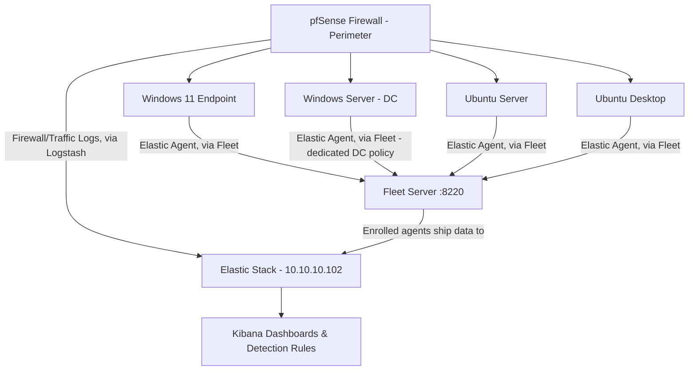

<h1 align="center">🖥️ SOC Home Lab - Build & Log Forwarding Plan</h1>
<h3 align="center">Phase 2: SIEM Live - All endpoints enrolled via Fleet</h3>

  
  
  

---

## 📋 Purpose

Before any SIEM can generate meaningful alerts, it needs consistent, well-configured log sources feeding it. This document covers the full build: standing up the operating systems and firewall, then introducing the SIEM itself (Elastic Stack) and connecting each host to it via Fleet-managed agents.

---

### 🧱 Lab Inventory - Virtual Machines

| # | OS | Role in Lab | Purpose |
|---|---|---|---|
| 1 | **pfSense Firewall** | Perimeter / Gateway | Sits at the edge of the lab network, filtering and is the first log source that shows *what tried to get in* before it ever reaches an endpoint |
| 2 | **Windows 11** | Endpoint / Workstation | Simulates a user endpoint where phishing, malware execution, and user-behavior events originate |
| 3 | **Windows Server** | Domain Controller / Server | Active Directory, DNS, authentication logs, the "crown jewel" logs in most real SOCs |
| 4 | **Ubuntu Server** | Linux Server | Simulates backend/infra services - SSH, sudo, and service logs | "Where the Elastic Stack SIEM is located and where Kibana and Logstash are configured."
| 5 | **Ubuntu (Desktop Image)** | Linux Endpoint | Comparison point to the Windows endpoint cross-platform log normalization practice |
| 6 | **Elastic Stack (on Ubuntu Server)** | SIEM - Elasticsearch, Kibana, Fleet Server | Central log store, dashboards, and the enrollment point every other agent connects through |

> All VMs run on **VirtualBox**, networked on an internal/host-only adapter so traffic stays isolated from my home network.

---

## 🌐 Planned Network Layout

Elasticsearch, Kibana, and Fleet Server are all hosted on the Ubuntu Server machine with the IP address `10.10.10.102`. Each endpoint enrolls through the Fleet Server on port `8220`. Once enrolled, the endpoints send data directly to Elasticsearch, eliminating the need for manual log shipper configuration on each host, as Fleet centrally manages the data collection for each agent. Additionally, the syslog output from pfSense is set to route through **Logstash** (which is also on the Elastic server) for parsing before it is indexed, since pfSense does not support Elastic's native agent protocol.

---

## 🔥 Firewall - Perimeter Configuration & Logging

**Goal:** Every packet that reaches an endpoint passes through here first; this is the earliest point in the lab where I can see attempted access, not just what already landed on a host.

- Deploying **pfSense** as a virtual appliance, sitting between the lab's internal network and the outside (Bridge Adapter)
- Configuring baseline **firewall rules**:
  - Default-deny inbound, explicit allow rules per VM/service
  - Segmenting the Windows Server (DC) and Ubuntu Server onto a restricted internal subnet, separate from the two endpoints
- Enabling **logging on both blocked and allowed traffic** - blocked traffic shows attempted access; allowed traffic gives a baseline of "normal" to compare against later
- Turning on the **pfSense package for log export** (planning to use the built-in syslog forwarding) so logs can ship out the same way the OS logs do
- Log shipper: forwarding via **syslog** to the SIEM once it's introduced - no separate agent needed, since pfSense speaks syslog natively

**Why this comes before the SIEM:** if the firewall isn't logging and forwarding correctly from day one, I'd have a blind spot at the perimeter - I'd only ever see what happened *after* something got past the firewall, not what it tried first.

---

## 🟢 SIEM Introduction - Elastic Stack

**Goal:** Stand up the actual SIEM and get every host reporting into it, rather than sitting on locally-generated logs no one is looking at.

**Stack chosen:** Elasticsearch + Kibana + Fleet Server, all running on the Ubuntu Server VM (`10.10.10.102`) - no separate dedicated SIEM VM. Keeps the lab lean for now; can be split onto its own VM later if resource contention becomes an issue.

### What's running
- **Elasticsearch** - the data store, secured with TLS (X-Pack security enabled by default on 8.x)
- **Kibana** - the dashboard/analysis layer, connects to Elasticsearch over HTTPS
- **Fleet Server** - the enrollment and policy-management layer; every endpoint agent checks in here on port `8220` before shipping data to Elasticsearch

### A deliberate architecture change from the original plan
The original plan was standalone **Winlogbeat**/**Filebeat** installed and configured individually on each host. In practice, I went with **Fleet-managed Elastic Agent** instead - a single agent per host, centrally configured and updated from Kibana's Fleet UI via **Integrations** (e.g. the *Windows* integration, *System* integration), rather than hand-editing a `winlogbeat.yml`/`filebeat.yml` on every machine.

**Why the switch:** managing four+ separate Beats configs by hand doesn't scale well even at this small a size, and Fleet gives centralized visibility into which agents are healthy, what policy they're running, and lets me push config changes (like adding a new log source) to every endpoint at once instead of touching each host individually. This is also closer to how larger, real-world SOC environments actually manage endpoint telemetry.

### Getting here wasn't trivial - the short version
Re-IP'ing the lab to `10.10.10.0/24` broke every existing TLS certificate (Elasticsearch, Kibana, and Fleet Server's own listener), since certs are cryptographically bound to the IPs/hostnames they were issued for. Resolving it end-to-end meant: regenerating the HTTP-layer cert with the correct SAN entries, fixing a keystore password mismatch after the cert swap, extracting and distributing the CA's public cert so Kibana would trust it, and separately solving the same trust problem again for Fleet Server's self-signed listener on port `8220` when enrolling the first agent. Full write-up of that investigation lives in the [Incident Documentation repo](https://github.com/Tmitchy/-SOC-Incident-Documentation/blob/main/investigations/002-kibana-elasticsearch-tls-trust-failure.md).

### Enrollment status

| Host | Agent Enrolled | Policy | Integrations Attached |
|---|---|---|---|
| Windows 11 | ✅ | Windows agent policy | System, Windows |
| Windows Server (DC) | ✅ | Windows Server (DC) policy - dedicated, separate from Windows 11 | System, Windows (custom channels: Directory Service, DNS Server) |
| Ubuntu Server | ✅ (also runs Fleet Server itself) | Fleet Server policy | System | 
| Ubuntu Desktop | ✅ | Linux agent policy | System | Auditd | Sysmtd |

All four endpoints are enrolled and reporting through Fleet as of this update. Standalone **Winlogbeat** and **Filebeat** - installed early on before settling on the Fleet-managed approach - were uninstalled from the hosts that had them, to avoid duplicate/conflicting data streams alongside the Elastic Agent integrations.

---

## ⚙️ Per-OS Configuration Plan

### 🪟 Windows 11 (Endpoint)
**Goal:** Capture process creation, network connections, and user activity at the endpoint level.

- Install **Sysmon** with a solid config (e.g., SwiftOnSecurity or Olaf Hartong's config) to log:
  - Process creation (Event ID 1)
  - Network connections (Event ID 3)
  - Image/DLL loads (Event ID 7)
- Enable **PowerShell Script Block Logging** (catches obfuscated/malicious scripts)
- Log shipping handled by **Fleet-managed Elastic Agent** (see SIEM Introduction section above) - the *Windows* integration in Fleet is configured to collect:
  - Security log
  - Sysmon operational log (once Sysmon is installed — added as a custom event log channel in the integration config)
  - PowerShell operational log

---

### 🪟 Windows Server (Domain Controller)
**Goal:** Capture authentication and directory-service events — the backbone of most SOC detections.

- Enable **Advanced Audit Policy** (not just legacy auditing):
  - Logon/Logoff events (4624, 4625, 4634)
  - Account management (4720, 4726, etc.)
  - Kerberos ticket events (4768, 4769) - useful for later detecting things like Kerberoasting
- Enable **DNS/DS debug/analytic logging** for visibility into resolution requests ( `Get-WinEvent -ListLog "Directory Service" -ErrorAction SilentlyContinue`, `Get-WinEvent -ListLog "DNS Server" -ErrorAction SilentlyContinue`)
- Enrolled under a **dedicated Fleet policy** (`Windows Server (DC) policy`), separate from the Windows 11 endpoint policy, since a DC needs different event log channels. The *Windows* integration on this policy adds custom channels on top of the defaults:
  - Directory Service log
  - DNS Server log

---

### 🐧 Ubuntu Server
**Goal:** Capture authentication, privilege escalation, and service-level activity.

- Configure **rsyslog** to centralize local logs (`/var/log/auth.log`, `/var/log/syslog`)
- Install **auditd** for deeper visibility:
  - `sudo`/`su` usage
  - File integrity on sensitive paths (`/etc/passwd`, `/etc/shadow`)
- This host also runs the Elastic Stack itself, so its own **Elastic Agent** (Fleet Server) uses the default **System** integration for baseline metrics; the *Auditd* integration will be added on top for the deeper visibility above

---

### 🐧 Ubuntu Desktop (Image)
**Goal:** A lighter-weight Linux endpoint for comparison against the Windows 11 box.

- Same **rsyslog** baseline as the server
- Once enrolled, **Elastic Agent** via Fleet with the *System* integration covers auth and syslog
- Standalone Filebeat was installed early on before the Fleet approach was settled, since it was removed to avoid duplicate data alongside the Elastic Agent integration
- Used mainly to practice normalizing Linux vs. Windows log formats once they hit the SIEM

---

## ✅ Progress... - Stage 2 (SIEM Live)

- [x] Elasticsearch installed, secured, and reachable over HTTPS
- [x] Kibana installed and trusting Elasticsearch's CA
- [x] Fleet Server installed and enrolling agents
- [x] First endpoint (Windows 11) enrolled with System + Windows integrations
- [x] Windows Server (DC) enrolled under a dedicated policy with Directory Service + DNS Server channels
- [x] Ubuntu Desktop enrolled
- [x] Standalone Winlogbeat/Filebeat uninstalled to avoid duplicate data with Fleet-managed agents
- [ ] Sysmon channel added to Windows integration config
- [ ] Auditd integration added on Ubuntu Server
- [x] Fleet Server's self-signed cert on port 8220 reissued using the lab CA (currently using `--insecure` for new enrollments as a workaround)
- [ ] Logstash pipeline confirmed/decided: keep for pfSense syslog parsing, or decommission if unused
- [x] First Kibana dashboard built from live data
- [ ] First detection rule created

---

## 📚 Resources I'm Using

### Sysmon & Windows Logging
- [Sysmon (Microsoft Sysinternals)](https://learn.microsoft.com/en-us/sysinternals/downloads/sysmon)
- [SwiftOnSecurity Sysmon Config](https://github.com/SwiftOnSecurity/sysmon-config)
- [Olaf Hartong's Sysmon Modular Config](https://github.com/olafhartong/sysmon-modular)
- [Microsoft - Advanced Audit Policy Configuration](https://learn.microsoft.com/en-us/windows-server/identity/ad-ds/plan/security-best-practices/audit-policy-recommendations)
- [Windows Security Event Log Encyclopedia (Ultimate Windows Security)](https://www.ultimatewindowssecurity.com/securitylog/encyclopedia/)

### Linux Logging
- [rsyslog Documentation](https://www.rsyslog.com/doc/)
- [Linux auditd Guide (Red Hat)](https://access.redhat.com/documentation/en-us/red_hat_enterprise_linux/9/html/security_hardening/auditing-the-system_security-hardening)

### Log Shipping (Elastic Stack)
- [Elastic Agent Reference](https://www.elastic.co/guide/en/fleet/current/elastic-agent-installation-configuration.html)
- [Fleet and Elastic Agent Guide](https://www.elastic.co/guide/en/fleet/current/fleet-server.html)
- [Elastic - Ingesting Windows Event Logs](https://www.elastic.co/guide/en/beats/winlogbeat/current/how-winlogbeat-works.html)

### Firewall
- [pfSense Official Documentation](https://docs.netgate.com/pfsense/en/latest/)
- [pfSense Syslog / Remote Logging Setup](https://docs.netgate.com/pfsense/en/latest/monitoring/syslog.html)

### Networking & Lab Setup
- [VirtualBox Networking Modes Explained](https://www.virtualbox.org/manual/ch06.html)
- [Active Directory Home Lab Setup Guide](https://adsecurity.org/?page_id=41)

### Detection Engineering (for later phases)
- [MITRE ATT&CK Framework](https://attack.mitre.org/)
- [Sigma Rules Repository](https://github.com/SigmaHQ/sigma)

> This list will keep growing as the lab progresses - new resources get added as I hit new problems.

---

## 🔜 Next Document: Detection Engineering

With all four endpoints enrolled and reporting through Fleet, the next phase covers adding Sysmon/auditd data sources, deciding Logstash's role (pfSense syslog parsing vs. decommissioning), building the first Kibana dashboards, and writing the first detection rules mapped to MITRE ATT&CK.

---

<i>Part 2 of a multi-part SOC home lab build series.</i>

