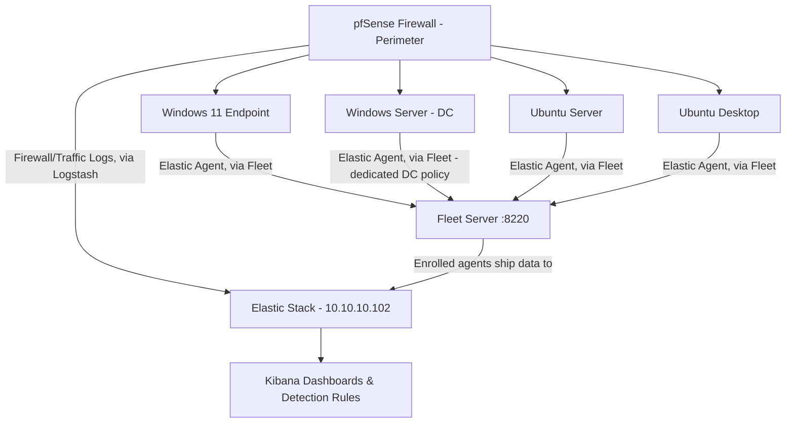

<h1 align="center">🖥️ SOC Home Lab - Build & Log Forwarding Plan</h1>
<h3 align="center">Phase 3: Full Pipeline Live - Firewall through Dashboard, End to End</h3>

  
  
  

---

## 📋 Purpose

Before any SIEM can generate meaningful alerts, it needs consistent, well-configured log sources feeding it. This document covers the full build: standing up the operating systems and firewall, introducing the SIEM (Elastic Stack), connecting each host via Fleet-managed agents, and routing the firewall's own logs through Logstash for parsing. As of this update, every planned piece of the original architecture is live and verified with real data- not just configured, but actually confirmed working end to end.

---

## 🧱 Lab Inventory - Virtual Machines

| # | OS | Role in Lab | Purpose |
|---|---|---|---|
| 1 | **Windows 11** | Endpoint / Workstation | Simulates a user endpoint where phishing, malware execution, and user-behavior events originate |
| 2 | **Windows Server** | Domain Controller / Server | Active Directory, DNS, authentication logs- the "crown jewel" logs in most real SOCs |
| 3 | **Ubuntu Server** | Linux Server | Simulates backend/infra services: SSH, sudo, and service logs. Also hosts the Elastic Stack and Logstash |
| 4 | **Ubuntu Image** | Linux Endpoint | A second Linux endpoint, discovered already enrolled and healthy during troubleshooting; comparison point for cross-platform log normalization |
| 5 | **pfSense Firewall** | Perimeter / Gateway | Sits at the edge of the lab network, traffic filtering, and the first log source that shows *what tried to get in* before it ever reaches an endpoint. Now actively forwarding filterlog + system events via syslog |
| 6 | **Elastic Stack (on Ubuntu Server)** | SIEM: Elasticsearch, Kibana, Fleet Server | Central log store, dashboards, and the enrollment point every other agent connects through |
| 7 | **Logstash (on Ubuntu Server)** | Log parsing/routing layer | Receives pfSense's raw syslog, parses `filterlog`'s CSV format into structured fields, and routes everything into its own `logs-pfsense-default` data stream |

> All VMs run on **VirtualBox**, networked on an internal/host-only adapter so traffic stays isolated from my home network.

---

## 🌐 Planned Network Layout

Elasticsearch, Kibana, Fleet Server, and Logstash all run on the Ubuntu Server box (`10.10.10.102`). Every endpoint enrolls through Fleet Server on port `8220`, and once enrolled, ships data straight to Elasticsearch- no manual per-host log shipper config needed, since Fleet centrally manages what each agent collects. pfSense's syslog output routes through **Logstash** (port `5514`, UDP+TCP), which parses `filterlog`'s CSV-formatted firewall events into structured fields (`src_ip`, `dst_ip`, `action`, `protocol`, etc.) while passing other pfSense subsystem messages (DHCP, system) through untouched, then routes everything into a dedicated `logs-pfsense-default` data stream, confirmed working end-to-end with live traffic.

---

## 🔥 Firewall (Perimeter Configuration & Logging)

**Goal:** Every packet that reaches an endpoint passes through here first; this is the earliest point in the lab where I can see attempted access, not just what already landed on a host.

- Deploying **pfSense** as a virtual appliance, sitting between the lab's internal network and the outside (host-only/NAT boundary).
- Configuring baseline **firewall rules**:
  - Default-deny inbound, explicit allow rules per VM/service
  - Segmenting the Windows Server (DC) and Ubuntu Server onto a restricted internal subnet, separate from the two endpoints
- Enabling **logging on both blocked and allowed traffic **; blocked traffic shows attempted access; allowed traffic gives a baseline of "normal" to compare against later.
- Turning on the **pfSense package for log export** confirmed working via built-in remote syslog forwarding, sending Firewall Events, System Events, DHCP, Auth, VPN, Gateway Monitor, NTP, and Wireless events to Logstash on `10.10.10.102:5514`.
- Log shipper: **syslog**, native to pfSense; no separate agent needed, confirmed with live blocked-traffic events landing in Elasticsearch.

**Why this comes before the SIEM:** If the firewall isn't logging and forwarding correctly from day one, I'd have a blind spot at the perimeter. I'd only ever see what happened *after* something got past the firewall, not what it tried first.

---

## 🟢 SIEM Introduction - Elastic Stack

**Goal:** Stand up the actual SIEM and get every host reporting into it, rather than sitting on locally-generated logs no one is looking at.

**Stack chosen:** Elasticsearch + Kibana + Fleet Server, all running on the Ubuntu Server VM (`10.10.10.102`), no separate dedicated SIEM VM. Keeps the lab lean for now; can be split onto its own VM later if resource contention becomes an issue.

### What's running
- ** Elasticsearch ** - the data store, secured with TLS (X-Pack security enabled by default on 8.x)
- ** Kibana ** - the dashboard/analysis layer, connects to Elasticsearch over HTTPS
- **Fleet Server** - the enrollment and policy-management layer; every endpoint agent checks in here on port `8220` before shipping data to Elasticsearch

### A deliberate architecture change from the original plan
The original plan was standalone **Winlogbeat**/**Filebeat** installed and configured individually on each host. In practice, I went with **Fleet-managed Elastic Agent** instead - a single agent per host, centrally configured and updated from Kibana's Fleet UI via **Integrations** (e.g. the *Windows* integration, *System* integration), rather than hand-editing a `winlogbeat.yml`/`filebeat.yml` on every machine.

**Why the switch:** managing four+ separate Beats configs by hand doesn't scale well even at this small a size, and Fleet gives centralized visibility into which agents are healthy, what policy they're running, and lets me push config changes (like adding a new log source) to every endpoint at once instead of touching each host individually. This is also closer to how larger, real-world SOC environments actually manage endpoint telemetry.

### Getting here wasn't trivial - the short version
Re-IP'ing the lab to `10.10.10.0/24` broke every existing TLS certificate (Elasticsearch, Kibana, and Fleet Server's own listener), since certs are cryptographically bound to the IPs/hostnames they were issued for. Resolving it end-to-end meant: regenerating the HTTP-layer cert with the correct SAN entries, fixing a keystore password mismatch after the cert swap, extracting and distributing the CA's public cert so Kibana would trust it, and separately solving the same trust problem again for Fleet Server's self-signed listener on port `8220` when enrolling the first agent. Full write-up of that investigation lives in the [Incident Documentation repo](./incident-documentation/investigations/001-kibana-elasticsearch-tls-trust-failure.md).

### Enrollment status

| Host | Agent Enrolled | Policy | Integrations Attached |
|---|---|---|---|
| Windows 11 | ✅ | Windows agent policy | System, Windows |
| Windows Server (DC) | ✅ | Windows Server (DC) policy - dedicated, separate from Windows 11 | System, Windows (custom channels: Directory Service, DNS Server) |
| Ubuntu Server | ✅ (also runs Fleet Server itself) | Fleet Server policy | System |
| Ubuntu Desktop | ✅ | Linux agent policy | System |

All four endpoints are enrolled and reporting through Fleet as of this update. Standalone **Winlogbeat** and **Filebeat** - installed early on before settling on the Fleet-managed approach - were uninstalled from the hosts that had them to avoid duplicate/conflicting data streams alongside the Elastic Agent integrations.

---

## 🚨 A Real Incident: The Silent Month-Long Outage

**What happened:** While confirming the pipeline was healthy, I noticed Discover's default "Last 15 minutes" view kept coming back empty. Rather than accept a wider relative time range at face value, I checked the actual document timestamps directly against `Get-Date` - and found the newest data in Elasticsearch was **three weeks old**. The entire SIEM had been silently dark since I re-addressed the network to `10.10.10.0/24`.

**Root cause, found by process of elimination:** every agent reported itself `HEALTHY`, Fleet's own internal telemetry was flowing normally, and Kibana showed no obvious errors - but real endpoint log data (syslog, Windows events) had genuinely stopped. Querying Elasticsearch directly (bypassing Kibana's UI entirely) confirmed that there were zero real documents in the last hour, despite "healthy" agents. Digging into each Windows agent's local logs surfaced the actual error: `x509: certificate signed by unknown authority`, tied to a **`ca_trusted_fingerprint`** mismatch - a CA fingerprint value hardcoded directly in `/etc/kibana/kibana.yml`, left over from an earlier certificate generation, silently surviving every subsequent cert regeneration because the Fleet UI's own output settings page showed the field as "managed outside of Fleet" and uneditable.

**Fix:** Located the exact line in `kibana.yml`, replaced the stale fingerprint with the current CA's actual SHA-256 fingerprint (computed via `openssl x509 -noout -fingerprint -sha256`, converted to the correct format via `sed`/`tr`), and restarted Kibana and all affected agents. Verified via direct Elasticsearch queries that real data resumed flowing within minutes.

**Why this was hard to find:** the failure mode looked identical to "everything's fine" from almost every angle - healthy agent status, a populated (if stale) document count, and a UI that never surfaced the actual blocking value since it lived outside the editable settings page entirely. Getting to the real cause required distrusting every UI-level signal and going straight to Elasticsearch's raw API for ground truth.

This is documented in full, including every dead end (a Kibana rendering glitch, an accidentally tiny time-range filter, a duplicate output entry) in the [Incident Documentation repo](./incident-documentation/).

---

## 🪵 Logstash - pfSense Log Parsing

**Goal:** get pfSense's raw syslog output properly parsed and searchable, rather than sitting as one unstructured text blob per event.

**The problem:** pfSense sends multiple message types over the same syslog stream:  `filterlog` (firewall block/pass decisions) is CSV-formatted, while DHCP and other system messages are plain text. An initial grok pattern designed for generic syslog text failed to match `filterlog`'s CSV format at all (100% grok failure rate), while a follow-up CSV filter over-applied itself to *every* pfSense message, corrupting the plain-text ones.

**The fix:**
- Added a `csv` filter scoped specifically to `process.name == "filterlog"`, parsing fields like `action`, `src_ip`, `dst_ip`, `protocol`, `interface`, leaving every other pfSense message type (DHCP, system) untouched.
- Explicitly set `[data_stream][dataset]` via `mutate { replace => ... }` (not `add_field`, which appends rather than overwrites) so pfSense events route to their own `logs-pfsense-default` data stream instead of falling into the generic Beats-destined index.

**Confirmed working:** live firewall block events (e.g. a blocked broadcast packet from a stale old-network IP hitting the new lab subnet) now land in Elasticsearch with fully parsed fields, correctly separated from unrelated DHCP/system chatter.

---

---

## ⚙️ Per-OS Configuration Plan

### 🪟 Windows 11 (Endpoint)
**Goal:** Capture process creation, network connections, and user activity at the endpoint level.

- Installed **Sysmon** with a solid config (e.g. SwiftOnSecurity or Olaf Hartong's config) to log:
  - Process creation (Event ID 1)
  - Network connections (Event ID 3)
  - Image/DLL loads (Event ID 7)
- Enable **PowerShell Script Block Logging** (catches obfuscated/malicious scripts)
- Log shipping handled by **Fleet-managed Elastic Agent** (see SIEM Introduction section above). The *Windows* integration in Fleet is configured to collect:
  - Security log
  - Sysmon operational log (once Sysmon is installed and added as a custom event log channel in the integration config)
  - PowerShell operational log

---

### 🪟 Windows Server (Domain Controller)
**Goal:** Capture authentication and directory-service events- the backbone of most SOC detections.

- Enable **Advanced Audit Policy** (not just legacy auditing):
  - Logon/Logoff events (4624, 4625, 4634)
  - Account management (4720, 4726, etc.)
  - Kerberos ticket events (4768, 4769) useful for later detecting things like Kerberoasting
- Enable **DNS debug/analytic logging** for visibility into resolution requests
- Enrolled under a **dedicated Fleet policy** (`Windows Server (DC) policy`), separate from the Windows 11 endpoint policy, since a DC needs different event log channels. The *Windows* integration on this policy adds custom channels on top of the defaults:
  - Directory Service log
  - DNS Server log
- Standalone Winlogbeat was installed early on before the Fleet approach was settled — since removed to avoid duplicate data alongside the Elastic Agent integration

---

### 🐧 Ubuntu Server
**Goal:** Capture authentication, privilege escalation, and service-level activity.

- Configure **rsyslog** to centralize local logs (`/var/log/auth.log`, `/var/log/syslog`)
- Installed **auditd** for deeper visibility:
  - `sudo`/`su` usage
  - File integrity on sensitive paths (`/etc/passwd`, `/etc/shadow`)
- This host also runs the Elastic Stack itself, so its own **Elastic Agent** (Fleet Server) uses the default **System** integration for baseline metrics — the *Auditd* integration will be added on top for the deeper visibility above

---

### 🐧 Ubuntu Desktop (Image)
**Goal:** A lighter-weight Linux endpoint for comparison against the Windows 11 box.

- Same **rsyslog** baseline as the server
- Once enrolled, **Elastic Agent** via Fleet with the *System* integration covers auth and syslogn
- Used mainly to practice normalizing Linux vs. Windows log formats once they hit the SIEM

---

## ✅ Readiness Checklist - Stage 1 (Environment Build)

- [x] pfSense deployed with default-deny rules and logging enabled
- [x] Sysmon installed & configured on Windows 11
- [ ] Advanced Audit Policy enabled on Windows Server
- [x] auditd installed & rules applied on Ubuntu Server
- [x] All VMs confirmed reachable on the internal lab network (5 originally planned, 6th — Ubuntu Image — found already enrolled)
- [x] Static IPs assigned to each VM for consistent log source identification

## ✅ Readiness Checklist - Stage 2 (SIEM Live)

- [x] Elasticsearch installed, secured, and reachable over HTTPS
- [x] Kibana installed and trusting Elasticsearch's CA
- [x] Fleet Server installed and enrolling agents
- [x] First endpoint (Windows 11) enrolled with System + Windows integrations
- [x] Windows Server (DC) enrolled under a dedicated policy with Directory Service + DNS Server channels
- [x] Ubuntu Desktop enrolled
- [x] Standalone Winlogbeat/Filebeat uninstalled to avoid duplicate data with Fleet-managed agents
- [x] Sysmon channel added to Windows integration config
- [x] Auditd integration added on Ubuntu Server
- [x] Logstash pipeline confirmed working, parsing and routing pfSense syslog into its own data stream
- [ ] First Kibana dashboard built from live data ("SOC Lab Overview" — traffic over time, top blocked IPs, protocol breakdown, recent events table)
- [ ] First detection rule created

---

## 🔜 Next Document: Detection Engineering

After confirming the full pipeline works end-to-end with the firewall through the dashboard, the next phase involves enabling the Advanced Audit Policy on the Domain Controller and writing the first detection rules that are mapped to MITRE ATT&CK using real data generated by this lab.

---

<i>Part 3 of a multi-part SOC home lab build series.</i>

---

[← Back to index](/README.md)
